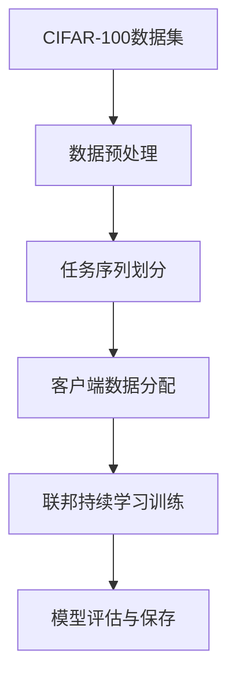

# Enhanced Federated Continual Learning 模型工作流程

## 1. 概述

本项目实现了一个增强版的联邦持续学习系统，基于 ResNet-18 模型架构，在 CIFAR-100 数据集上进行训练。该系统支持在保护数据隐私的前提下，实现跨设备的持续学习能力，防止灾难性遗忘。

## 2. 系统架构

### 2.1 核心组件

- **EnhancedFederatedLearning**: 联邦学习主框架，负责全局模型管理、任务序列处理和客户端协调
- **EnhancedFLClient**: 客户端实现，处理本地训练、记忆存储和回放机制
- **ResNet18**: 主干网络模型，用于图像分类任务
- **TrainingLogger**: 训练日志记录器，记录训练过程中的各项指标

### 2.2 数据流

## 3. 工作流程详解

### 3.1 初始化阶段

1. **设备配置**: 检查并配置计算设备(CUDA/GPU或CPU)
2. **数据加载**: 使用 `get_data_loaders` 函数加载并预处理CIFAR-100数据集
3. **任务序列创建**: 通过 `create_task_sequence_datasets` 将100个类别划分为10个任务序列
4. **模型初始化**: 创建全局模型 `ResNet18` 实例
5. **客户端初始化**: 创建指定数量的 `EnhancedFLClient` 实例

### 3.2 任务序列处理流程

#### 3.2.1 任务注册阶段

1. 为当前任务创建客户端数据加载器
2. 根据配置选择IID或Non-IID数据划分方式
3. 使用 `register_task` 方法注册当前任务到所有客户端

#### 3.2.2 联邦训练阶段

每个任务包含多个训练轮次，每轮训练流程如下：

1. **客户端采样**: 随机选择一部分客户端参与训练
2. **梯度计算与EMA更新**:
   - 计算采样客户端的分类器梯度
   - 使用指数移动平均(EMA)更新全局梯度估计
3. **模型分发**: 将全局模型参数和EMA梯度分发给采样客户端
4. **本地训练**: 客户端在本地数据上进行训练，包含以下增强机制:
   - 梯度对齐惩罚: 通过 [compute_gradient_alignment_penalty](file://C:\py\Projects\enhance_federated_learning\enhance_fl_client.py#L140-L159) 计算并应用惩罚项
   - 回放数据训练: 使用 [get_replay_data](file://C:\py\Projects\enhance_federated_learning\enhance_fl_client.py#L88-L106) 获取历史任务数据防止遗忘
   - L2正则化: 防止对旧知识的覆盖
5. **模型聚合**: 使用 [aggregate_updates](file://C:\py\Projects\enhance_federated_learning\enhance_federated_learning.py#L202-L224) 聚合客户端模型更新
6. **全局模型更新**: 应用聚合后的更新到全局模型

#### 3.2.3 任务完成阶段

1. 调用 [finish_task](file://C:\py\Projects\enhance_federated_learning\enhance_federated_learning.py#L69-L75) 方法触发记忆存储
2. 各客户端使用 [store_task_memory](file://C:\py\Projects\enhance_federated_learning\enhance_fl_client.py#L65-L86) 存储当前任务的重要样本

### 3.3 持续学习机制

#### 3.3.1 记忆存储机制

- 每个客户端维护一个 [task_memory](file://C:\py\Projects\enhance_federated_learning\enhance_fl_client.py#L32-L32) 字典存储历史任务样本
- 通过 [store_task_memory](file://C:\py\Projects\enhance_federated_learning\enhance_fl_client.py#L65-L86) 方法在任务完成时存储当前任务样本
- 存储样本数量受 `fcl_memory_size` 参数控制

#### 3.3.2 回放机制

- 训练时通过 [get_replay_data](file://C:\py\Projects\enhance_federated_learning\enhance_fl_client.py#L88-L106) 方法获取历史任务样本
- 将回放数据与当前任务数据合并进行训练
- 防止灾难性遗忘，保持对历史任务的性能

#### 3.3.3 梯度对齐惩罚

- 计算客户端本地梯度与全局EMA梯度的差异
- 通过 [gamma](file://C:\py\Projects\enhance_federated_learning\enhance_fl_client.py#L27-L27) 参数控制惩罚强度
- 提升模型收敛稳定性和一致性

### 3.4 评估与日志记录

1. **模型评估**: 使用 [evaluate_global_model](file://C:\py\Projects\enhance_federated_learning\enhance_federated_main_continual.py#L107-L171) 在测试集上评估模型性能
2. **日志记录**: 通过 [TrainingLogger](file://C:\py\Projects\enhance_federated_learning\training_logger.py#L7-L156) 记录每轮训练结果
3. **性能监控**: 记录损失、准确率、运行时间等指标

## 4. 关键技术细节

### 4.1 Non-IID数据划分

使用Dirichlet分布进行数据划分:
- 通过 `fed_alpha` 参数控制Non-IID程度
- 较小的alpha值导致更严重的Non-IID分布
- 确保每个客户端至少有2个样本避免BatchNorm错误

### 4.2 模型增强机制

#### EMA(指数移动平均)
- 通过 `fed_ema_weight` 控制历史梯度的影响权重
- 平滑全局梯度估计，提高训练稳定性

#### 梯度对齐惩罚
- 通过 `fed_gamma` 控制惩罚强度
- 使客户端梯度与全局趋势保持一致

### 4.3 持续学习策略

#### 任务序列管理
- 将CIFAR-100划分为10个任务，每个任务包含10个类别
- 按顺序学习各个任务

#### 遗忘防止机制
- 样本回放: 存储历史任务重要样本
- 正则化: L2正则化防止参数大幅变化
- 渐进式学习: 逐步增加模型知识

## 5. 配置参数说明

### 5.1 联邦学习参数

| 参数                 | 默认值 | 说明         |
|--------------------|-----|------------|
| `fed_num_clients`  | 10  | 参与训练的客户端数量 |
| `fed_num_rounds`   | 100 | 总训练轮次      |
| `fed_local_epochs` | 1   | 客户端本地训练轮次  |
| `fed_global_lr`    | 1.0 | 全局学习率      |

### 5.2 持续学习参数

| 参数                | 默认值 | 说明        |
|-------------------|-----|-----------|
| `fcl_num_tasks`   | 10  | 持续学习任务数   |
| `fcl_memory_size` | 200 | 每客户端记忆样本数 |

### 5.3 Non-IID参数

| 参数               | 默认值  | 说明            |
|------------------|------|---------------|
| `fed_use_noniid` | True | 是否使用Non-IID划分 |
| `fed_alpha`      | 0.5  | Dirichlet分布参数 |

## 6. 输出与结果

### 6.1 模型文件
- `continual_enhanced_federated_resnet18_cifar100.pth`: 最终训练完成的全局模型

### 6.2 日志文件
- [training_log.json](file://C:\py\Projects\enhance_federated_learning\continual_logs_cifar100\training_log.json): 训练历史记录(JSON格式)
- [training_log.csv](file://C:\py\Projects\enhance_federated_learning\continual_logs_cifar100\training_log.csv): 训练历史记录(CSV格式)
- `final_results.json`: 最终评估结果

### 6.3 评估指标
- 损失值(loss)
- 准确率(accuracy)
- 运行时间(elapsed_time)
- Non-IID效果指标(noniid_effectiveness)

## 7. 使用建议

1. **硬件要求**: 建议使用GPU加速训练过程
2. **参数调优**: 根据实际需求调整 `fed_gamma` 和 `fed_ema_weight`
3. **数据划分**: 可通过调整 `fed_alpha` 控制Non-IID程度
4. **持续学习**: 可增加任务数量或调整每个任务的类别数